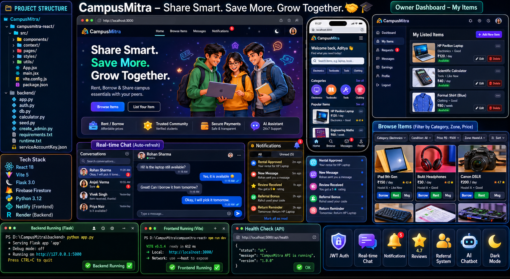
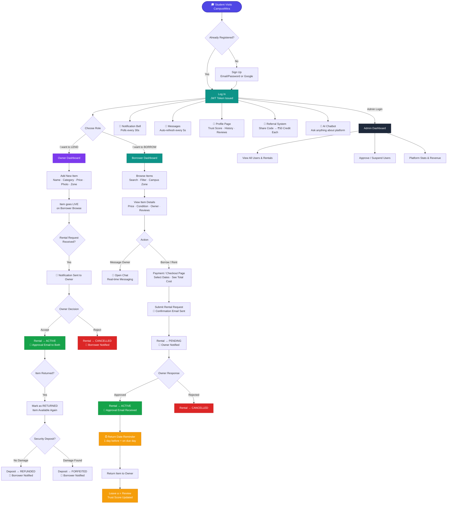
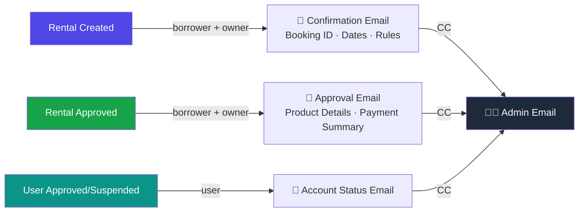
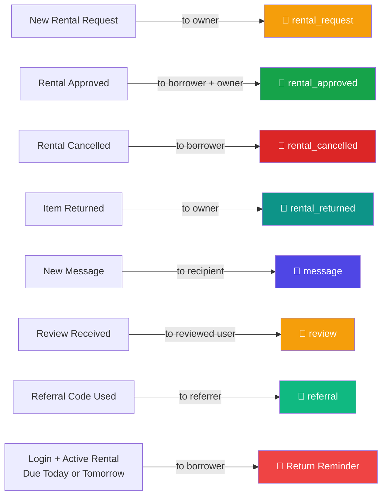

# CampusMitra 🤝




A platform for college students to **rent, borrow, and share campus essentials** — reducing expenses, minimizing waste, and building a trusted campus community.

> "Share Smart. Save More. Grow Together."

---

### Why CampusMitra?
- 💰 **Save Money** — Rent items at 50-70% lower than buying new
- ♻️ **Reduce Waste** — Make items work harder, not the landfill
- 🤝 **Build Community** — Connect with peers who share your lifestyle
- ⭐ **Trust System** — Rating-based reputation keeps everyone honest
- 🔒 **Secure** — Security deposits protect both borrowers and lenders


## ✨ Features

### Feature Overview

| Category | Feature | Status |
|----------|---------|--------|
| 🔐 Auth | Email/Password + Google Sign-In | ✅ |
| 🔐 Auth | JWT tokens (7-day expiry) | ✅ |
| 📦 Items | List, edit, delete items with photo | ✅ |
| 📦 Items | Category + condition + price filters | ✅ |
| 📍 Items | Campus Zone filter | ✅ |
| 🤝 Rentals | Borrow & Rent requests | ✅ |
| 🤝 Rentals | Owner approve / reject / return | ✅ |
| 🤝 Rentals | Security deposit management | ✅ |
| 💬 Messages | Borrower ↔ Owner real-time chat | ✅ |
| 💬 Messages | Auto-refresh every 5s | ✅ |
| 💬 Messages | Unread badge on navbar icon | ✅ |
| 🔔 Notifications | In-app bell with unread count | ✅ |
| 🔔 Notifications | Rental / message / review / referral alerts | ✅ |
| 🔔 Notifications | Return date reminders (today + tomorrow) | ✅ |
| ⭐ Reviews | Star ratings after completed rental | ✅ |
| ⭐ Reviews | Trust Score auto-calculation | ✅ |
| 👤 Profile | Public profile with history & stats | ✅ |
| 🎁 Referral | Unique code + ₹50 credit for both users | ✅ |
| 📧 Email | Rental confirmation + approval emails | ✅ |
| 🤖 Chatbot | AI assistant (Gemini + rule-based fallback) | ✅ |
| 🌙 UI | Dark mode with correct CSS variables | ✅ |
| 📱 UI | Fully responsive (mobile sidebar) | ✅ |
| 🛡️ Admin | User approve/suspend + platform stats | ✅ |

### Core Platform
- **Browse & Search** — filter items by category, condition, price range, availability, and campus zone
- **Borrow & Rent** — every item card has Borrow, Rent, and Message Owner buttons
- **Campus Zone Filter** — filter items by hostel block / campus area
- **Owner Dashboard** — list items with photo upload, manage availability, accept/reject rental requests, forfeit/refund security deposits
- **Borrower Dashboard** — browse all items, track active and past rentals, cancel requests
- **Payment / Checkout Page** — rental confirmation with date picker, cost calculator, deposit summary

### Auth & Security
- **JWT Auth** — email/password signup + Google Sign-In via Firebase
- **Rate Limiting** — per-IP request throttling on all auth and write endpoints
- **Firestore Transactions** — race-condition-safe rental creation
- **Admin Panel** — approve/suspend users, view all rentals and platform stats

### In-App Messaging
- **Borrower ↔ Owner Chat** — real-time messaging linked to rental items
- **Auto-refresh** — messages update every 5 seconds when chat is open (no page reload needed)
- **Unread Badge** — message icon in navbar shows unread count, updates every 30 seconds
- **Conversation Sidebar** — lists all conversations with last message preview and unread count

### Notifications
- **In-App Notification Bell** — polls every 30 seconds, shows unread count badge
- **Rental Notifications** — alerts for new requests, approvals, cancellations, returns
- **Message Notifications** — notified when someone sends you a message
- **Review Notifications** — notified when you receive a star rating
- **Referral Notifications** — notified when your referral code is used
- **Return Date Reminders** — automatic reminder the day before and on the day a rental is due back (triggered on login, no duplicates)

### Reviews & Ratings
- **Star Ratings (1–5)** — leave a review after a completed rental
- **Trust Score** — auto-calculated average displayed on every profile
- **Review History** — all reviews visible on the user's profile page

### Profile Page
- **Public Profile** — name, department, year, campus zone, bio, trust score
- **Stats Overview** — completed rentals, cancelled rentals, items listed, average rating
- **Tabs** — Overview, Reviews, Items Listed, Referral (own profile only)
- **Edit Profile** — update name, department, year, campus zone, bio inline

### Referral / Invite System
- **Unique Referral Code** — auto-generated per user
- **₹50 Credit** — both referrer and new user get credit on successful signup
- **Share Link** — one-click copy of invite URL
- **Referral Stats** — friends invited count and total credits earned

### Email Notifications
- **Rental Created** — confirmation email to borrower + owner with full details and rental rules
- **Rental Approved** — detailed approval email with product info, payment summary, and agreement
- **Admin CC** — admin receives a copy of every rental agreement email

### AI Chatbot
- **CampusMitra Assistant** — answers questions about the platform in English or Hinglish
- **Live Item Search** — chatbot searches Firestore and returns matching available items
- **Rule-based Fallback** — works without a Gemini API key using built-in responses
- **Gemini Integration** — optional Gemini 2.5 Flash for richer conversational responses

### UI / UX
- **Dark Mode** — full dark theme with correct CSS variables across all components
- **Responsive** — mobile sidebar, hamburger nav, single-column layouts on small screens
- **Skeleton Loaders** — shimmer placeholders while items load in browse grid
- **Toast Notifications** — success / error / info toasts for all user actions

---

## 🛠 Tech Stack

| Layer     | Technology                                                        |
|-----------|-------------------------------------------------------------------|
| Frontend  | React 18, React Router v6, Vite                                   |
| Styling   | Plain CSS with CSS variables (dark/light mode)                    |
| Backend   | Python 3, Flask, Flask-JWT-Extended, Flask-CORS, Flask-Mail       |
| Database  | Firebase Firestore                                                |
| Auth      | Firebase Auth (Google Sign-In) + JWT (email/password)             |
| AI        | Google Gemini 2.5 Flash (optional) + rule-based fallback          |
| Email     | Gmail SMTP via Flask-Mail                                         |
| Hosting   | Render (backend) + Netlify (frontend)                             |

---

## 📁 Project Structure

```
CampusMitra/
├── campusmitra-react/          # React frontend (Vite)
│   ├── src/
│   │   ├── App.jsx             # Routes
│   │   ├── main.jsx            # Entry point
│   │   ├── components/
│   │   │   ├── Navbar.jsx      # Top nav with notification bell + message badge
│   │   │   ├── NotificationBell.jsx  # In-app notification dropdown
│   │   │   ├── AuthModal.jsx   # Login / signup modal
│   │   │   ├── Chatbot.jsx     # AI assistant widget
│   │   │   └── Toast.jsx       # Toast notification system
│   │   ├── context/
│   │   │   └── AuthContext.jsx # Auth state + return reminder trigger on login
│   │   ├── pages/
│   │   │   ├── Home.jsx        # Landing page
│   │   │   ├── OwnerDashboard.jsx    # Owner: list items, manage requests
│   │   │   ├── BorrowerDashboard.jsx # Borrower: browse, filter, track rentals
│   │   │   ├── MessagesPage.jsx      # Real-time chat with auto-refresh
│   │   │   ├── ProfilePage.jsx       # Profile, reviews, referral
│   │   │   ├── Payment.jsx           # Rental checkout
│   │   │   └── AdminDashboard.jsx    # Admin panel
│   │   ├── styles/
│   │   │   ├── style.css       # Global styles + dark mode variables
│   │   │   └── dashboard.css   # Dashboard & item card styles
│   │   └── utils/
│   │       ├── api.js          # API base URL
│   │       ├── firebaseAuth.js # Google Sign-In
│   │       ├── helpers.js      # Category icons/gradients
│   │       ├── theme.js        # Dark mode toggle
│   │       └── useScrollRestore.js
│   ├── vite.config.js          # Dev proxy → Flask backend
│   └── package.json
└── backend/
    ├── app.py                  # Flask API — all routes
    ├── auth.py                 # JWT middleware (login_required decorator)
    ├── db.py                   # Firestore client initialisation
    ├── calculator.py           # Rental cost calculator
    ├── seed.py                 # Seed script — categories & sample items
    ├── create_admin.py         # Script to set admin flag on a user
    ├── requirements.txt        # Python dependencies
    ├── runtime.txt             # Python version for Render
    └── serviceAccountKey.json  # Firebase service account (not committed)
```

---

## 🚀 Getting Started

### 1. Clone the repo

```bash
git clone https://github.com/your-username/campusmitra.git
cd campusmitra
```

### 2. Set up Firebase

1. Go to [Firebase Console](https://console.firebase.google.com/) and create a project
2. Enable **Firestore Database** and **Authentication** (Email/Password + Google providers)
3. Go to Project Settings → Service Accounts → Generate new private key
4. Save the downloaded file as `backend/serviceAccountKey.json`

> ⚠️ Never commit `serviceAccountKey.json` — it's in `.gitignore`

### 3. Configure environment

Create `backend/.env`:

```env
JWT_SECRET=your-secret-key-here
FIREBASE_CREDENTIALS=serviceAccountKey.json
FIREBASE_STORAGE_BUCKET=your-project-id.appspot.com

# Email (Gmail SMTP) — optional but recommended
MAIL_USERNAME=your-gmail@gmail.com
MAIL_PASSWORD=your-app-password
ADMIN_EMAIL=your-admin@gmail.com

# Gemini AI — optional
GEMINI_API_KEY=your-gemini-api-key

# Frontend URL (for email links)
FRONTEND_URL=http://localhost:3000
```

### 4. Install backend dependencies

```bash
cd backend
pip install -r requirements.txt
```

### 5. Seed the database

```bash
python seed.py
```

Creates the 4 categories and a set of sample items.

### 6. Run the backend

```bash
python app.py
```

Backend starts at `http://localhost:5000`.

### 7. Run the frontend

```bash
cd campusmitra-react
npm install
npm run dev
```

Frontend starts at `http://localhost:3000`. Vite proxies all `/api` requests to Flask automatically.

---

## 📡 API Reference

### Auth

| Method | Endpoint           | Auth | Description                    |
|--------|--------------------|------|--------------------------------|
| POST   | `/api/auth/signup` | —    | Register with email + password |
| POST   | `/api/auth/login`  | —    | Login with email + password    |
| POST   | `/api/auth/google` | —    | Login / register with Google   |
| GET    | `/api/auth/me`     | ✅   | Get current user               |

### Items

| Method | Endpoint          | Auth | Description                                                    |
|--------|-------------------|------|----------------------------------------------------------------|
| GET    | `/api/items`      | —    | List items (filter: category, condition, available, min/max price) |
| GET    | `/api/items/<id>` | —    | Get single item                                                |
| POST   | `/api/items`      | ✅   | Create new listing                                             |
| PUT    | `/api/items/<id>` | ✅   | Update your listing                                            |
| DELETE | `/api/items/<id>` | ✅   | Delete your listing                                            |

### Categories & Search

| Method | Endpoint                 | Auth | Description                          |
|--------|--------------------------|------|--------------------------------------|
| GET    | `/api/categories`        | —    | List all categories with stats       |
| GET    | `/api/categories/<slug>` | —    | Category detail + items (filterable) |
| GET    | `/api/search?q=query`    | —    | Full-text search across items        |

### Rentals

| Method | Endpoint                          | Auth | Description                             |
|--------|-----------------------------------|------|-----------------------------------------|
| POST   | `/api/rentals`                    | ✅   | Create rental request                   |
| GET    | `/api/rentals?role=borrower`      | ✅   | My rentals as borrower                  |
| GET    | `/api/rentals?role=lender`        | ✅   | My rentals as lender                    |
| PUT    | `/api/rentals/<id>/status`        | ✅   | Update status (pending→active→returned) |
| PUT    | `/api/rentals/<id>/deposit`       | ✅   | Update deposit status (owner only)      |
| POST   | `/api/rentals/check-reminders`    | ✅   | Trigger return date reminder check      |

### Messages

| Method | Endpoint                              | Auth | Description                        |
|--------|---------------------------------------|------|------------------------------------|
| GET    | `/api/messages/conversations`         | ✅   | List all conversations             |
| GET    | `/api/messages/conversations/<id>`    | ✅   | Get messages in a conversation     |
| POST   | `/api/messages/send`                  | ✅   | Send a message (creates conv if needed) |

### Notifications

| Method | Endpoint                    | Auth | Description                        |
|--------|-----------------------------|------|------------------------------------|
| GET    | `/api/notifications`        | ✅   | Get notifications (latest 30)      |
| PUT    | `/api/notifications/read`   | ✅   | Mark all notifications as read     |

### Profile & Reviews

| Method | Endpoint              | Auth | Description                                    |
|--------|-----------------------|------|------------------------------------------------|
| GET    | `/api/profile/<id>`   | —    | Full profile: info + items + rentals + reviews |
| GET    | `/api/profile/me`     | ✅   | Current user's full profile                    |
| PUT    | `/api/profile/me`     | ✅   | Update profile (name, dept, zone, bio)         |
| POST   | `/api/reviews`        | ✅   | Submit a review for a completed rental         |
| GET    | `/api/reviews/<id>`   | —    | Get all reviews for a user                     |

### Referral

| Method | Endpoint              | Auth | Description                          |
|--------|-----------------------|------|--------------------------------------|
| GET    | `/api/referral/code`  | ✅   | Get or generate your referral code   |
| POST   | `/api/referral/apply` | ✅   | Apply a referral code                |

### Campus Zones

| Method | Endpoint                    | Auth | Description                          |
|--------|-----------------------------|------|--------------------------------------|
| GET    | `/api/zones`                | —    | List all zones with item counts      |
| GET    | `/api/items/by-zone/<zone>` | —    | Get available items in a zone        |

### Admin

| Method | Endpoint                          | Auth  | Description                    |
|--------|-----------------------------------|-------|--------------------------------|
| GET    | `/api/admin/stats`                | Admin | Platform-wide stats            |
| GET    | `/api/admin/users`                | Admin | List all users                 |
| PUT    | `/api/admin/users/<id>/approve`   | Admin | Approve or suspend a user      |
| GET    | `/api/admin/rentals`              | Admin | List all rentals               |

### Misc

| Method | Endpoint      | Auth | Description                        |
|--------|---------------|------|------------------------------------|
| GET    | `/api/stats`  | —    | Public platform stats              |
| GET    | `/api/health` | —    | Health check → `{"status": "ok"}` |
| POST   | `/api/chat`   | —    | AI chatbot (Gemini + fallback)     |

---

## 🔄 How CampusMitra Works — Complete Flowchart



---

## 📬 Email Notification Flow



---

## 🔔 Notification Trigger Map




```
pending → active → returned
   └──────────────→ cancelled
```

| Status      | Description                                              |
|-------------|----------------------------------------------------------|
| `pending`   | Request submitted, waiting for owner approval            |
| `active`    | Owner accepted, item is with borrower                    |
| `returned`  | Item returned, becomes available again, deposit refunded |
| `cancelled` | Rejected by owner or cancelled by borrower               |

---

## 🔔 Notification Types

| Type               | Trigger                                      |
|--------------------|----------------------------------------------|
| `rental_request`   | Owner receives a new rental request          |
| `rental_approved`  | Borrower's rental is approved by owner       |
| `rental_cancelled` | Rental is cancelled                          |
| `rental_returned`  | Item marked as returned                      |
| `message`          | New chat message received                    |
| `review`           | Someone leaves you a star rating             |
| `referral`         | Your referral code is used by a new user     |

---

## ⚙️ Environment Variables

| Variable                    | Description                                  | Default                    |
|-----------------------------|----------------------------------------------|----------------------------|
| `JWT_SECRET`                | Secret key for signing JWT tokens            | `campus-mitra-secret-2026` |
| `FIREBASE_CREDENTIALS`      | Path to `serviceAccountKey.json`             | `serviceAccountKey.json`   |
| `FIREBASE_CREDENTIALS_JSON` | Full JSON string (for Render deployment)     | —                          |
| `FIREBASE_STORAGE_BUCKET`   | Firebase storage bucket name                 | `campus-share-2f42b.appspot.com` |
| `MAIL_USERNAME`             | Gmail address for sending emails             | —                          |
| `MAIL_PASSWORD`             | Gmail App Password                           | —                          |
| `ADMIN_EMAIL`               | Email address with admin privileges          | `hacktolearn001@gmail.com` |
| `GEMINI_API_KEY`            | Google Gemini API key (optional)             | —                          |
| `FRONTEND_URL`              | Frontend URL for email links                 | —                          |

---

## 🚢 Deployment

### Architecture

```
┌─────────────────────────────────────────────────────────────────────┐
│                        CampusMitra Architecture                      │
└─────────────────────────────────────────────────────────────────────┘

  ┌──────────────────┐        HTTPS         ┌──────────────────────┐
  │                  │  ─────────────────►  │                      │
  │   Netlify CDN    │                      │   Render (Flask)     │
  │  React + Vite    │  ◄─────────────────  │   Python Backend     │
  │                  │     JSON / REST       │                      │
  └──────────────────┘                      └──────────┬───────────┘
           │                                           │
           │  Static Assets                            │  Firebase Admin SDK
           │  (HTML/CSS/JS)                            │
           ▼                                           ▼
  ┌──────────────────┐                      ┌──────────────────────┐
  │   Browser /      │                      │  Firebase Firestore  │
  │   Mobile Web     │                      │  (NoSQL Database)    │
  └──────────────────┘                      └──────────────────────┘
                                                       │
                                            ┌──────────┴───────────┐
                                            │   Firebase Auth      │
                                            │  (Google Sign-In)    │
                                            └──────────────────────┘
```

### Request Flow

```
User Action (React)
      │
      ▼
 AuthContext  ──► JWT Token (localStorage)
      │
      ▼
 fetch('/api/...')
      │
      ▼  [Vite proxy in dev / direct URL in prod]
      │
      ▼
 Flask Route  ──► login_required decorator
      │                    │
      │              verify JWT
      │                    │
      ▼                    ▼
 Firestore Query      get_current_user()
      │
      ▼
 JSON Response  ──► React State Update  ──► UI Re-render
```

### Data Model

```
users/
  {uid}/
    name, email, department, year, campus_zone
    trust_score, bio, credits
    referral_code, referral_used

items/
  {item_id}/
    name, description, price_amount, price_unit
    condition, deposit_amount, campus_zone
    category_slug, image_url, is_available
    owner_id, owner{id, name, department, trust_score}

rentals/
  {rental_id}/
    item_id, borrower_id, lender_id
    status, rental_type, start_date, end_date
    total_price, deposit_amount, deposit_status
    item_snapshot{}

conversations/
  {conv_id}/
    participants[], last_message, last_at
    unread_{uid}, rental_id, item_name
    messages/ (subcollection)
      {msg_id}/ sender_id, text, created_at

notifications/
  {notif_id}/
    user_id, type, message, ref_id
    is_read, created_at

reviews/
  {review_id}/
    rental_id, reviewer_id, reviewer_name
    review_for, rating, comment, created_at

referrals/
  {ref_id}/
    referrer_id, referred_id, code, created_at
```

### Backend → Render

1. Push repo to GitHub
2. Go to [render.com](https://render.com) → New Web Service → connect your repo
3. Set **Root Directory** to `backend`
4. Set **Build Command** to `pip install -r requirements.txt`
5. Set **Start Command** to `gunicorn app:app`
6. Add environment variables in Render dashboard:

| Key                         | Value                                              |
|-----------------------------|----------------------------------------------------|
| `FIREBASE_CREDENTIALS_JSON` | Paste entire contents of `serviceAccountKey.json`  |
| `JWT_SECRET`                | Any strong random string                           |
| `GEMINI_API_KEY`            | From [Google AI Studio](https://aistudio.google.com/) |
| `FRONTEND_URL`              | Your Netlify URL e.g. `https://campusmitra.netlify.app` |
| `MAIL_USERNAME`             | Your Gmail address                                 |
| `MAIL_PASSWORD`             | Your Gmail App Password                            |
| `ADMIN_EMAIL`               | Your admin email                                   |
| `FIREBASE_STORAGE_BUCKET`   | `your-project-id.appspot.com`                      |

**Health check:** `GET /api/health` → `{"status": "ok"}`

### Frontend → Netlify

1. Go to [netlify.com](https://netlify.com) → Add new site → Import from Git
2. Set **Base directory** to `campusmitra-react`
3. Set **Build command** to `npm run build`
4. Set **Publish directory** to `campusmitra-react/dist`
5. Deploy

After deploying, update `campusmitra-react/src/utils/api.js` with your Render backend URL:

```js
export const API = 'https://your-render-service.onrender.com/api';
```

---

## 📦 Categories

| Slug          | Name                   |
|---------------|------------------------|
| `electronics` | Electronics            |
| `textbooks`   | Textbooks & Study      |
| `tools`       | Tools & Equipment      |
| `clothing`    | Clothing & Formal Wear |

---

## 🔮 Future Scope

- **Smart Matching Algorithm** — AI matches borrowers with lenders based on location and history
- **Razorpay / UPI Integration** — online payments and automated deposit refunds
- **Item Availability Calendar** — visual calendar showing booked dates per item
- **Rental Receipt PDF** — downloadable receipt with booking ID, dates, and rules
- **Report User / Item** — flag abusive users or fake listings
- **Infinite Scroll / Pagination** — for large item catalogs
- **React Native App** — iOS and Android with offline support
- **Owner Analytics** — earnings, most-rented items, peak demand periods

---

## Made with ❤️ for students, by students
